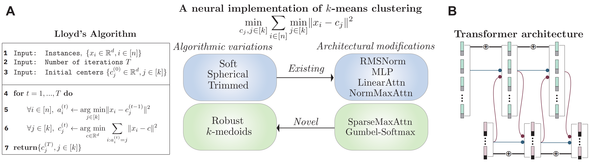
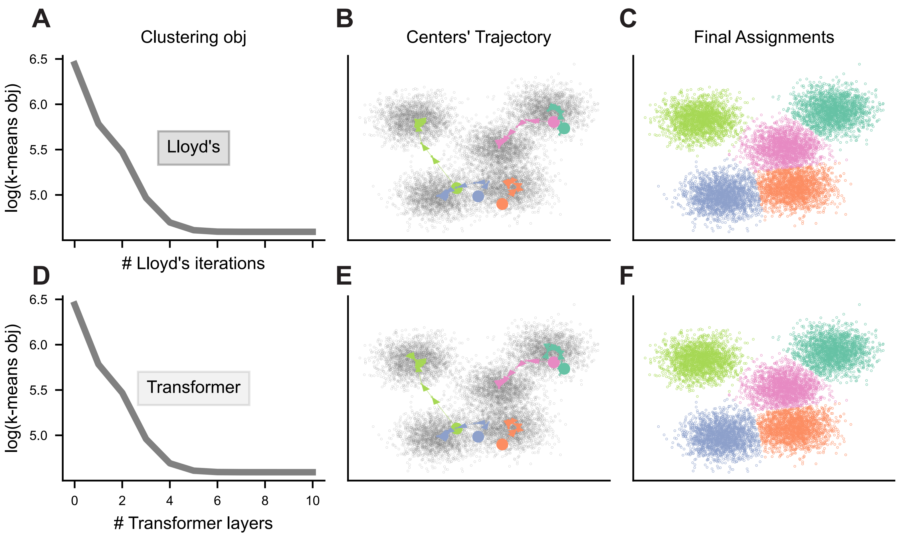

# Transformer Circuits Can Realize Clustering Algorithms

<div align="center">

#### Kenneth L. Clarkson<sup>🏢</sup> · Lior Horesh<sup>🏢</sup> · Takuya Ito<sup>🏢</sup> · Charlotte Park<sup>🎓</sup> · Parikshit Ram<sup>🏢</sup>

<sub><sup>🏢</sup> <strong>IBM Research</strong> &nbsp;&nbsp; <sup>🎓</sup> <strong>EECS, MIT</strong></sub>

</div>

<div align="center">

📄 **[ICML camera-ready (PDF)](assets/Clarkson_2026_Transformer_Clustering.pdf)** (🚀 Preliminary version on arXiv [](https://arxiv.org/abs/2506.19125))

</div>

> [!NOTE]
>  ⚠️ 🚧 **Under construction** <br>
Code, results and plotting scripts coming soon!

**Abstract.**
Although transformers are most commonly optimized as statistical sequence models, it is unclear to what extent they can implement and learn exact algorithmic computations. Here, we specify a transformer implementation from first principles that executes a fundamental and widely used method for $k$-means clustering: Lloyd's algorithm. We theoretically prove and empirically demonstrate that this implementation of a transformer architecture, which we term the $k$-_means transformer_, exactly implements Lloyd's algorithm for $k$-means clustering using the standard circuit mechanisms of modern transformers: attention block, residual connections, and feed-forward block. In learning experiments, we find that training this base architecture on $k$-means clustering yields a generalizable clustering algorithm that surpasses Lloyd's algorithm in terms of clustering quality. Finally, we demonstrate that interpretable alterations (e.g., inclusion of layer normalizations) to this architecture yields diverse and novel variants of clustering algorithms, including soft $k$-means, spherical $k$-means, trimmed $k$-means. Overall, our results show that transformer circuit mechanisms can instantiate exact algorithmic routines for clustering, while simultaneously providing an effective learnable model.

## Main Results

<div align="center">
  
  <p><em>Overview</em>
    For the $k$-means clustering problem (<b>top</b>) -- a discrete optimization task commonly solved via Lloyd's algorithm <b>(A)</b> -- we introduce a precise transformer architecture <b>(B)</b> that exactly implements Lloyd's iteration using standard components, including self-attention, cross-attention, and residual connections.
    Specifying precise algorithmic subroutines with transformer circuit mechanisms allows us to (i)~implement variations of $k$-means clustering, such as spherical and soft $k$-means (<b>center left blue box</b>), by modifying transformer mechanisms (<b>center right blue box</b>), and further (ii)~devise novel (and interpretable) $k$-means variations (<b>center left green box</b>) by incorporating existing transformer mechanisms such as sparse and Gumbel attention (<b>center right green box</b>).
  </p>
</div>

<div align="center">
  
  <p><em>Numerical Validation</em>
     We compare the $k$-means transformer to Lloyd's algorithm in $d=2$ dimensions with $n=10000$ points and $k=5$ clusters using $\gamma=10^4$. We present: <b>(A-C)</b> The objective function, evolution of cluster centers, and final assignments after 10 iterations of Lloyd's algorithm. <b>>(D-F)</b> Same as <b>>(A-C)</b>, but after forward-pass through 10 layers of the $k$-means transformer. In panels <b>>B</b> and <b>>E</b>, initial cluster centers are the circles $\bullet$ while the evolving cluster centers are shown as $\blacktriangle$.
  </p>
</div>


## Empirical Evaluations

### Environment setup

Assuming CUDA is properly setup on the machine, we will be using python version 3.13

```
> cd kmeans-trf
> conda create -n kmt
> conda activate kmt
> conda install python=3.13 pip>25.0
> conda install cudatoolkit -c anaconda  # <== OPTIONAL: if we have access to a GPU
> pip install -r requirements.txt
```

### Experimental details

The details on running the scripts for the training and evaluation is in [expts.md](./expts.md). 